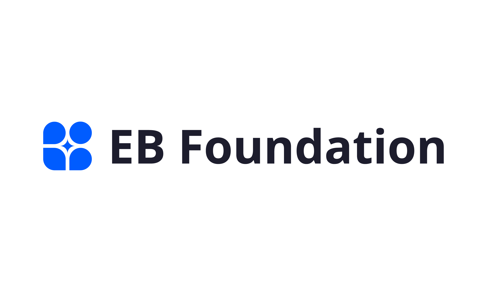
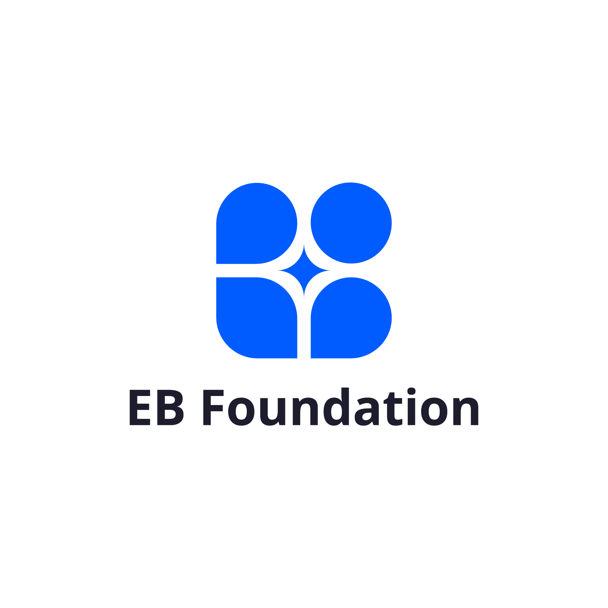
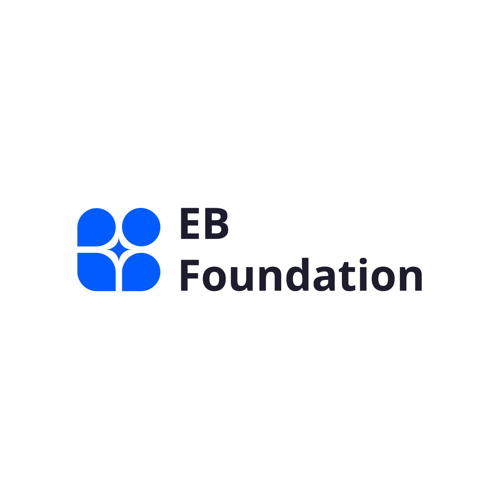

# Hướng dẫn Brand Guideline - EB Foundation

Tài liệu này tổng hợp các tiêu chuẩn nhận diện thương hiệu cho **EB Foundation** dựa trên tệp `EBFoundation-Brand-Guideline.pdf` và các tài nguyên đi kèm.

---

## 1. Logo
- Logo chính của EB Foundation được cung cấp với các định dạng tiêu chuẩn.
- **Tập tin Logo tham khảo:** 

### Logo đầy đủ (Full Logo)
- **Ngang - Nền sáng:** `Full-Logo-Horizontal-Light-BG@3x.png`

- **Dọc - Nền sáng:** `Full-Logo-Vertical-Light-BG@3x.png`

### Logo rút gọn (Short Logo)
- **Ngang - Nền sáng:** `Short-Logo-Horizontal-Light-BG@3x.png`

- **Ngang - Nền tối:** `Short-Logo-Horizontal-Dark-BG@3x.png`

---

## 2. Bảng Màu (Color Palette)

### 🎨 Màu Chủ Đạo (Primary Colors)
Đây là các màu sắc nền tảng, được sử dụng xuyên suốt trong đại đa số các ấn phẩm thiết kế.

| Tên Màu | Hex Code | RGB | CMYK |
| :--- | :--- | :--- | :--- |
| **Ultramarine Blue** | `#005cff` | 0, 92, 255 | 100, 64, 0, 0 |
| **Russian Black** | `#1d1d2d` | 29, 29, 45 | 36, 36, 0, 82 |
| **Baby Powder** | `#fffffa` | 255, 255, 250 | 0, 0, 2, 0 |

### 🌈 Màu Phụ Trợ (Secondary Colors)
Nhóm màu này được sử dụng để tạo điểm nhấn, các thành phần tương tác hoặc minh họa nhằm tăng sự sinh động.

| Tên Màu | Hex Code | RGB | CMYK |
| :--- | :--- | :--- | :--- |
| **UFO Green** | `#2dd881` | 45, 216, 129 | 79, 0, 40, 15 |
| **Electric Violet** | `#6100ff` | 97, 0, 255 | 62, 100, 0, 0 |
| **Vivid Sky Blue** | `#00e0ff` | 0, 224, 255 | 100, 12, 0, 0 |
| **Chrome Yellow** | `#ffa800` | 255, 168, 0 | 0, 34, 100, 0 |
| **Vivid Yellow** | `#ffe500` | 255, 229, 0 | 0, 10, 100, 0 |

---

## 3. Kiểu Chữ (Typography)
Phông chữ chủ đạo mang lại sự hiện đại và dễ đọc cho thương hiệu là **Noto Sans**. Việc sử dụng linh hoạt các biến thể (weights) giúp tạo ra hệ thống phân cấp nội dung rõ ràng:

- **Tiêu đề chính (Title / Heading):** 
  - `Noto Sans - ExtraBold`
- **Tiêu đề phụ (Sub-title):** 
  - `Noto Sans - Medium`
- **Nội dung văn bản (Content):** 
  - `Noto Sans - Light`
- **Nút bấm / Call to Action (Button):** 
  - `Noto Sans - ExtraBold`
  - *Lưu ý khoảng cách chữ (Letter Spacing): 3%*
